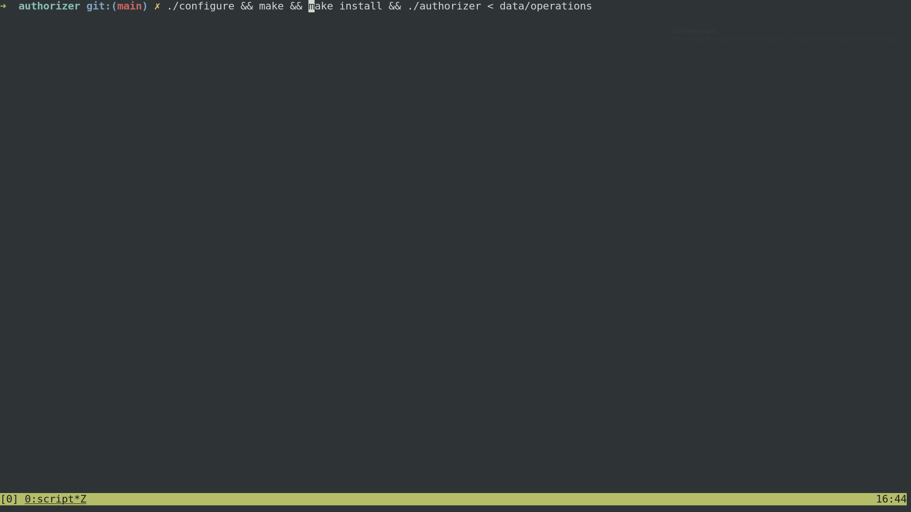
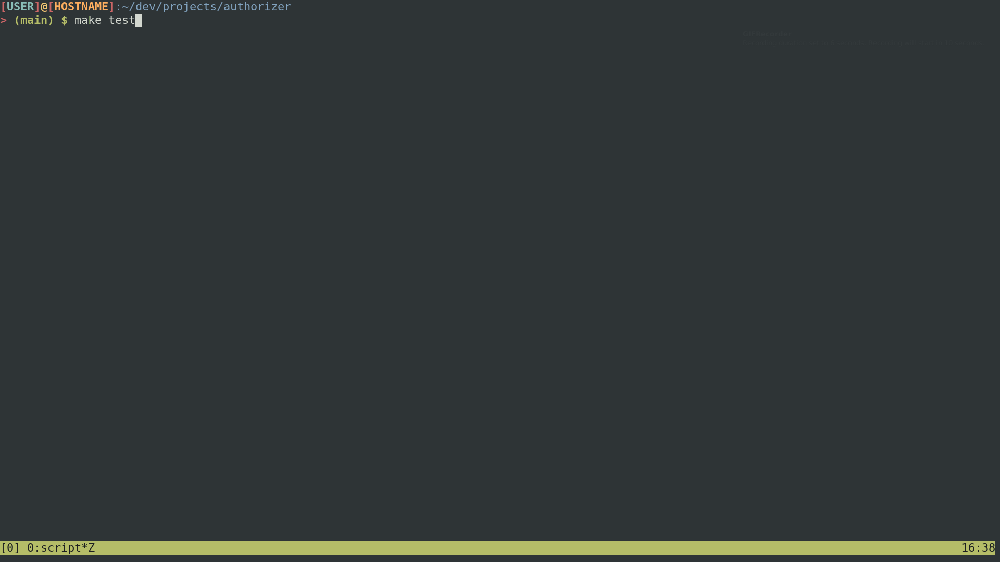

# authorizer
This CLI application authorizes a transaction according predefined rules

## Table of Contents
* [TL;DR](#tldr)
* [Prerequisites](#prerequisites)
    * [To run](#to-run-in-docker-container)
    * [To develop](#to-run-locally)
* [About](#about)
* [Test](#test)
  * [Unit Test](#unit-test)
  * [Integration Test](#integration-test)
  * [Both of them](#both-of-them)
  * [Acceptance Test](#acceptance-test)

### TLDR
``` shell
./configure
```
Configure will check if all prerequisites are installed. It uses `command` application. 
See: **Important Disclaimer** at the top of the [configure](scripts/configure.sh) file for troubleshooting.
``` shell
make && make install
```
To assemble Docker container and create executable file (just an alias for `docker run` command).
``` shell
./authorizer < data/operations
```
The output should be:
``` shell

{"Account":{"active-card":true,"available-limit":100},"violations":[]}
{"Account":{"active-card":true,"available-limit":80},"violations":[]}
{"Account":{"active-card":true,"available-limit":80},"violations":["insufficient-limit"]}
{"Account":{"active-card":true,"available-limit":50},"violations":[]}

```
Running on [Bash](https://www.gnu.org/software/bash/)


Running on [On My Zsh](https://ohmyz.sh/)

### Prerequisites


#### To run in Docker container
You only need [Make](https://www.gnu.org/software/make/) (tested with GNU Make 4.2.1, but it should work on others) 
and [Docker](https://www.docker.com/) (tested with Docker version 20.10.2, build 2291f61)  installed. It is important to give execution permission for `scripts/`:
``` shell
chmod +x scripts/
```
They are safe, but you could check it out if you don't believe me. :smile:
#### To run locally
[Go 1.16](https://golang.org/dl/) ecosystem installed. I'm pretty sure it might work in the recent old versions `1.1[0-6]`, but I actually did not test.

### About
Authorizer is a tiny CLI application that receives a series of events through standard input, 
process them and returns the results in standard output. For a matter of simplicity, this application cannot run
in concurrent environments, there is neither synchronization nor lock strategy to read or write into timeline
data structure.


### Test
#### Unit test
``` shell
make unit-test
```
The you only need [Go 1.16](https://golang.org/dl/) ecosystem to run it. Easy peasy.
#### Integration test
``` shell
make integration-test
```
Integration tests calls `make install` target to create `authorizer` executable and call it through integration test.
This test just guarantees that main function is calling internal services properly. It needs [Make](https://www.gnu.org/software/make/)
to run it.
#### Both of them
``` shell
make test
```

#### Acceptance test
``` shell
make install && ./acceptance_tests
```
Acceptance tests emulates the real execution of the application. It uses all input data files stored into 
[data](data/) directory and compares the result with each respective expected output file. It was tested on
[Bash](https://www.gnu.org/software/bash/) and [On My Zsh](https://ohmyz.sh/). I did not test it 
on others unpopular shells as csh, sh or pwsh.
